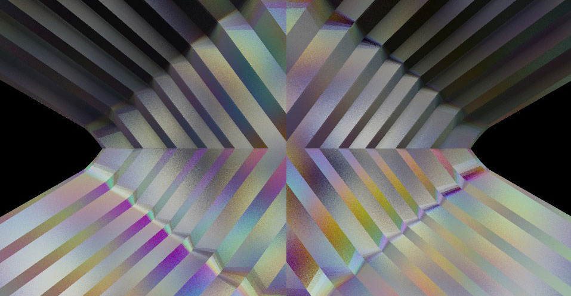

# Ray Marching Experiments

Here lies my experiments in ray marching. Be warned. Their beauty is only skin
deep. While fair on the exterior, the code that lies beneath is full of maggots.
I intentionally leave it this way to focus on experimental aspect while coding.

Ray marching is the process of moving along a ray coming out of the camera
towards a scene for every pixel on the screen. You moving along this ray based
on the minimum distance to any surface in the scene as described by a distance
field. Since the distance from the distance field is the minimum distance to any
object, you know you can move along your ray that distance without hitting an
object. So you proceed to do this with each step until you reach a point where
you are within a small enough distance from an object that you have effectively
hit the surface.

## Install

```bash
npm install
```

## Run

**Note:** Currently I am using unreleased modules of my own creation
for doing shader work with [WebVR](https://webvr.info/) & [Google
Cardboard](https://vr.google.com/cardboard/). Examples should
work but you will not be able to run the code yourself. [Tweet me
@lejeunerenard](https://twitter.com/lejeunerenard) if you want these modules
completed.

```bash
npm start
```

## Resources:

- [Raymarching Distance Fields by Simon
Hugo](http://9bitscience.blogspot.com/2013/07/raymarching-distance-fields_14.html)

## Technologies Used

- [stack.gl](http://stack.gl)
- [glslify](https://github.com/stackgl/glslify)
